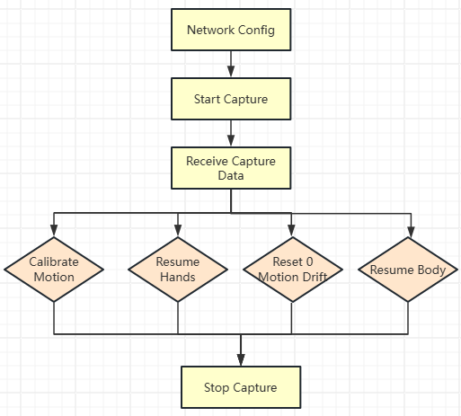
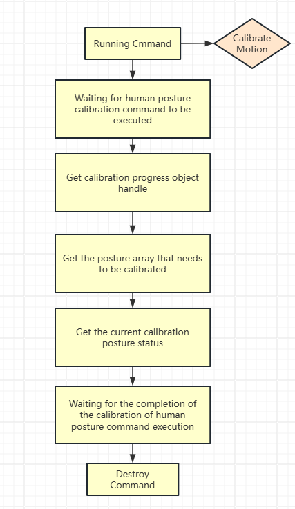

# PN-Link Python Operation Manual

## Introduction

PN-Link is a full-body wired inertial motion capture product launched by Noitom. Data from each sub-node on the body is aggregated to the main node (a device on the back) through wired connections and then sent to the host via the network.

Unlike other wireless inertial motion capture products, PN-Link offers a new connection mode (Direct Connection Mode). Users can directly connect to the PN-Link main node via the MocapApi SDK without installing Noitom's host software Axis Studio to complete data acquisition and human body posture calibration operations.

This project demonstrates how to use Python to call the MocapApi SDK to directly connect to the PN-Link main node and complete the above functions.

The project includes the following files:

- **mocap_api.py**: The Python interface class for MocapApi.
- **mocap_main_base.py**: The base class for calling the MocapApi interface.
- **mocap_main.py**: Acquires data from PN-Link and completes related command functions through console interaction.
- **mocap_main_robot_ros2.py**: Acquires data from PN-Link, retargets it, and then publishes and subscribes to messages through ROS2.
- **mocap_main_stickman_ros2.py**: Acquires data from PN-Link, publishes joint state messages through ROS2, and creates and visualizes a stickman model using the TF (Transform) library.

> Among them, mocap_main.py, mocap_main_robot_ros2.py, and mocap_main_stickman_ros2.py are three independent executable apps. The latter two include the functions of mocap_main.py and add the functionality of publishing different subscription messages based on ROS2.

## Environment Preparation

1. Install Python 3.x or above.
2. Install the required libraries: docutils, pynput.
3. PN-Link Wired Kit.
4. To run mocap_main_robot_ros2 and mocap_main_stickman_ros2, ensure that the ROS2 environment is installed.

## Network Configuration

The PN-Link main node is configured with a fixed IP address: 10.42.0.202, and it listens on UDP port: 8080.

Therefore, the IP address of the machine running the current script must be set to the same subnet, such as 10.42.0.101.

The corresponding configuration code example is as follows:

Python

复制

```python
class MCPBase:
    def __init__(self):
        self.app = MCPApplication()  # Create an application instance
        settings = MCPSettings()  # Create a settings instance
        
        # Configure BVH data format to binary
        settings.set_bvh_data(MCPBvhData.Binary)
        # Enable BVH data transformation
        settings.set_bvh_transformation(MCPBvhDisplacement.Enable)
        # Set rotation order to YZX
        settings.set_bvh_rotation(MCPBvhRotation.YZX)
        # Configure UDP data transmission address and port
        settings.SetSettingsUDPEx('10.42.0.101', 8002)
        settings.SetSettingsUDPServer('10.42.0.202', 8080)
        
        # Apply settings to the application instance and open the connection
        self.app.set_settings(settings)
        self.app.open()
```

## Commands

### Command Execution Order

- Establish network connection
- Execute acquisition command
- Print acquired data
- Execute other commands
- Stop acquisition



### Command Execution Flow

- Create command
- Execute command
- Wait for command execution to complete
- Destroy command


### Calibration Process



~~~python
def handleRunning(self, commandRespond):
        # Handle calibration progress
        _calibrateProgressHandle = MCPCommand().get_progress(commandRespond._commandHandle)
        progressHandle = MCPCalibrateMotionProgress(_calibrateProgressHandle)
        count = progressHandle.get_count_of_support_poses()

        str_poses = "Support poses:"
        for i in range(count):
            name = progressHandle.get_name_of_support_poses(i)
            str_poses += name
            if i + 1 != count:
                str_poses += ", "
        str_poses += " : "     
        
        # Get calibration step and pose name
        result_current_step, result_p_name = progressHandle.get_step_current_pose()
        if result_current_step == MCPCalibrateMotionProgressStep.CalibrateMotionProgressStep_Countdown:
            # Get calibration countdown
            result_countdown, result_p_name = progressHandle.get_countdown_current_pose()
            str_poses += (f"Calibration-({result_p_name})-Countdown {result_countdown}.")
        elif result_current_step == MCPCalibrateMotionProgressStep.CalibrateMotionProgressStep_Progress:
            # Get calibration progress
            result_progress, result_p_name = progressHandle.get_progress_current_pose()
            str_poses += (f"Calibration-({result_p_name})-Progress {result_progress}.")
        elif result_current_step == MCPCalibrateMotionProgressStep.CalibrateMotionProgressStep_Prepare:
            str_poses += (f"Calibration-({result_p_name}) is preparing.")
        else:
            str_poses += (f'Calibration-Unknown({result_current_step}) is running.')

        print(str_poses) 
~~~

## Base Class (mocap_main_base.py)

- The implementation class for calling the MocapApi interface.

### 1. Initialization

```python
class MCPBase:
    def __init__(self):
        # Initialize current command and running command status
        self.current_command = -1  # Current executing command
        self.capture_key = False  # Capture status flag
        self.connent_key = False  # Connection status flag
        self.app = MCPApplication()  # Create an application instance
        settings = MCPSettings()  # Create a settings instance
        
        # Configure BVH data format to binary
        settings.set_bvh_data(MCPBvhData.Binary)
        # Enable BVH data transformation
        settings.set_bvh_transformation(MCPBvhDisplacement.Enable)
        # Set rotation order to YZX
        settings.set_bvh_rotation(MCPBvhRotation.YZX)
        # Configure UDP data transmission address and port
        settings.SetSettingsUDPEx('10.42.0.101', 8002)
        settings.SetSettingsUDPServer('10.42.0.202', 8080)
        
        # Apply settings to the application instance and open the connection
        self.app.set_settings(settings)
        self.app.open()
```

### 2. Get Current Command Title

```python
    def get_current_command_title(self):
        # Return the title corresponding to the current command
        if self.current_command == EMCPCommand.CommandStartCapture:
            return 'Start Capture'
        elif self.current_command == EMCPCommand.CommandStopCapture:
            return 'Stop Capture'
        elif self.current_command == EMCPCommand.CommandCalibrateMotion:
            return 'Calibrate Motion'
        elif self.current_command == EMCPCommand.CommandResumeOriginalHandsPosture:
            return 'Resume Hands'
        elif self.current_command == EMCPCommand.CommandClearZeroMotionDrift:
            return 'Reset 0 Motion Drift'
        else:
            return 'None'
```

### 3. Check Current Command

```python
    def check_current_command(self, running_command):
        # Check if the specified command can be executed
        if self.connent_key == False:
            print('Link failure.')  # Print error message when not connected
            return False
        elif self.current_command != -1:
            # If another command is running, prohibit executing other commands
            print(f'Pending command {self.get_current_command_title()} is running.')
            return False
        # Except for the start capture command, all other commands require starting capture first
        elif self.capture_key == False and running_command != EMCPCommand.CommandStartCapture:
            print('Please start capture command first.')
            return False
        return True
```

### 4. Execute Command

```python
    def running_command(self, running_command):
        # Execute the specified command
        if self.check_current_command(running_command) == True:
            self.app.queue_command(running_command)  # Execute the command
            self.current_command = running_command  # Update the current command
```

### 5. Handle Notification Events

```python
    def handleNotify(self, notifyData):
        # Handle notification events
        if notifyData._notify == MCPEventNotify.Notify_SystemUpdated:
            mcpSystem = MCPSystem(notifyData._notifyHandle)  # Get system information
            print(f'MasterInfo : ( Version : {mcpSystem.get_master_version()}, SerialNumber : {mcpSystem.get_master_serial_number()} )')
```

### 6. Handle Command Results

```python
    def handleResult(self, commandRespond):
        # Handle command results
        command = MCPCommand()
        _commandHandle = commandRespond._commandHandle
        ret_code = command.get_result_code(_commandHandle)
        if ret_code != 0:
            ret_msg = command.get_result_message(_commandHandle)
            print(f'ResultCode: {self.get_current_command_title()}, ResultMessage: {ret_msg}')  # Print command execution error message
        else:
            print(f'{self.get_current_command_title()} done.')  # Print command execution success message
            if self.current_command == EMCPCommand.CommandStopCapture:
                self.capture_key = False
        command.destroy_command(_commandHandle)  # Destroy the command handle
        self.current_command = -1  # Reset the current command
```

### 7. Handle Calibration Commands

```python
    def handleRunning(self, commandRespond):
        # Handle calibration progress
        _calibrateProgressHandle = MCPCommand().get_progress(commandRespond._commandHandle)
        progressHandle = MCPCalibrateMotionProgress(_calibrateProgressHandle)
        count = progressHandle.get_count_of_support_poses()

        str_poses = "Support poses:"
        for i in range(count):
            name = progressHandle.get_name_of_support_poses(i)
            str_poses += name
            if i + 1 != count:
                str_poses += ", "
        str_poses += " : "     
        
        # Get calibration step and pose name
        result_current_step, result_p_name = progressHandle.get_step_current_pose()
        if result_current_step == MCPCalibrateMotionProgressStep.CalibrateMotionProgressStep_Countdown:
            # Get calibration countdown
            result_countdown, result_p_name = progressHandle.get_countdown_current_pose()
            str_poses += (f"Calibration-({result_p_name})-Countdown {result_countdown}.")
        elif result_current_step == MCPCalibrateMotionProgressStep.CalibrateMotionProgressStep_Progress:
            # Get calibration progress
            result_progress, result_p_name = progressHandle.get_progress_current_pose()
            str_poses += (f"Calibration-({result_p_name})-Progress {result_progress}.")
        elif result_current_step == MCPCalibrateMotionProgressStep.CalibrateMotionProgressStep_Prepare:
            str_poses += (f"Calibration-({result_p_name}) is preparing.")
        else:
            str_poses += (f'Calibration-Unknown({result_current_step}) is running.')

        print(str_poses)    
```

### 8. Asynchronous Update

```python
    async def update(self):
        try: 
            # Asynchronous update function for event loop processing
            while True:
                evts = self.app.poll_next_event()  # Get the next event
                for evt in evts:
                    self.connent_key = True
                    if evt.event_type == MCPEventType.AvatarUpdated:
                        if self.current_command != EMCPCommand.CommandCalibrateMotion:
                            self.capture_key = True
                            self.handleAvatar(evt.event_data.avatar_handle)
                    elif evt.event_type == MCPEventType.Notify:
                        self.handleNotify(evt.event_data.notifyData)
                    elif evt.event_type == MCPEventType.CommandReply:
                        if evt.event_data.commandRespond._replay == MCPReplay.MCPReplay_Response:
                            print('MCPReplay_Response')
                        elif evt.event_data.commandRespond._replay == MCPReplay.MCPReplay_Running:
                            self.handleRunning(evt.event_data.commandRespond)
                        elif evt.event_data.commandRespond._replay == MCPReplay.MCPReplay_Result:
                            self.handleResult(evt.event_data.commandRespond)
                    elif evt.event_type == MCPEventType.RigidBodyUpdated:
                        print('rigid body updated')
                await asyncio.sleep(0.1)  # Wait for 0.1 seconds
        except Exception as e:
            print(f"An error occurred: {e}")    
```

### 9. Main Asynchronous Function

```python
    async def main_async(self):
        # Main asynchronous function
        main = self
        loop = asyncio.get_event_loop()

        # Keyboard event handler
        def on_key_press(key):
            try:
                key_name = key.char.lower()
                print(f"Key pressed: {key_name}")
                if key_name == 'n':
                    main.running_command(EMCPCommand.CommandStartCapture)
                elif key_name == 'f':
                    main.running_command(EMCPCommand.CommandStopCapture)
                elif key_name == 'c':
                    main.running_command(EMCPCommand.CommandCalibrateMotion)
                elif key_name == 'r':
                    main.running_command(EMCPCommand.CommandResumeOriginalHandsPosture)     
                elif key_name == 'v':
                    main.running_command(EMCPCommand.CommandClearZeroMotionDrift)     
            except AttributeError:
                if key == key.esc:
                    print("ESC key pressed, exiting program")
                    return False  # Exit the listener

        # Start the keyboard listener
        with Listener(on_press=on_key_press) as listener:
            asyncio.run_coroutine_threadsafe(main.update(), loop)  # Start event update
            print("Press N to Start Capture, F to Stop Capture, C to calibrate, R to Resume Hands, V to Reset 0 Motion Drift, press ESC to exit program")
            await loop.run_in_executor(None, listener.join)  # Wait for the listener to exit
```

## Processing PN-Link Data and Printing (mocap_main.py)

- Acquire data from PN-Link and print data information

### 1. Initialization

```python
class MCPMain(MCPBase):
    def __init__(self):
        super().__init__()
```

### 2. Processing PN-Link Acquisition Data

- Acquire PN-Link data and print it

```python
    def handleAvatar(self, avatar_handle):
        # Handle avatar update event
        avatar = MCPAvatar(avatar_handle)  # Get avatar data
        joints = avatar.get_joints()  # Get all joint data
        str_data = '{'
        for joint in joints:
            link_name = joint.get_name()  # Get joint name
            position = joint.get_local_position()  # Get joint position
            rotation = joint.get_local_rotation()  # Get joint rotation
            str_data += f'{link_name} : {position}, {rotation}'
        str_data += '}'
        print(f"links_data: {str_data}")  # Print joint data
```

### 3. Main Function

```python
    def main(self):
        asyncio.run(self.main_async())

if __name__ == '__main__':
    MCPMain().main()
```

## ROS2 Message Publishing Class (mocap_main_robot_ros2.py)

- ROS2 URDF setup and configuration can be referenced at: [GitHub - pnmocap/mocap_ros_urdf: This is a URDF (Unified Robot Description Format) project used to define the structure and joint information of robots.](https://github.com/pnmocap/mocap_ros_urdf)

### 1. Initialization

```python
class MCPMainRobotROS2(MCPBase):
    def __init__(self):
        super().__init__()
        rclpy.init()
        self.node = Node("json_to_joint_state_publisher")
        self.publisher = self.node.create_publisher(JointState, "/joint_states", 10)
        json_file_path = './retarget.json'
        self.robot = MCPRobot(open(json_file_path).read())
        # Load joint names from JSON file
        with open(json_file_path, 'r') as file:
            data = json.load(file)
        self.joint_names = data['urdfJointNames']  
```

### 2. Processing PN-Link Data and Publishing ROS2 Messages

```python
    def handleAvatar(self, avatar_handle):
        try:
            # Handle avatar update event
            avatar = MCPAvatar(avatar_handle)  # Get avatar data
            self.robot.update_robot(avatar)
            self.robot.run_robot_step()
            # print(robot.get_robot_ros_frame_json())

            # Get real-time data from the robot
            real_time_data = json.loads(self.robot.get_robot_ros_frame_json()[0])

            # Create JointState message
            joint_state_msg = JointState()
            joint_state_msg.header.stamp = self.node.get_clock().now().to_msg()
            joint_state_msg.name = self.joint_names

            # Initialize joint positions
            joint_positions = [0.0] * len(self.joint_names)

            # Fill joint positions with real-time data
            for i, name in enumerate(self.joint_names):                    
                if name in real_time_data['joint_positions']:
                    joint_positions[i] = real_time_data['joint_positions'][name]

            joint_state_msg.position = joint_positions
            self.publisher.publish(joint_state_msg)

            # print(f"Joint positions: {joint_positions}")

        except Exception as e:
            print(e)
```

### 3. Main Function

```python
    def main(self):
        asyncio.run(self.main_async())
        
if __name__ == '__main__':
    MCPMainRobotROS2().main()  # Start the main program
```

## Generating Stickman through ROS2 TF (mocap_main_stickman_ros2.py)

- ROS2 stickman setup and configuration can be referenced at: [GitHub - pnmocap/mocap_ros_urdf: This is a URDF (Unified Robot Description Format) project used to define the structure and joint information of robots.](https://github.com/pnmocap/mocap_ros_urdf)

### 1. Initialization

```python
class MCPMainStickmanROS2(MCPBase):
    def __init__(self):
        super().__init__()
        rclpy.init()
        self.node = Node("real_time_transform_publisher")
        self.br = StaticTransformBroadcaster(self.node)  
```

### 2. Defining Parent-Child Relationships for Each Joint

```
# Define parent-child relationships for each link
links_parent = {
    "Hips": "world",
    "RightUpLeg": "Hips",
    "RightLeg": "RightUpLeg",
    "RightFoot": "RightLeg",
    "RightTiptoe": "RightFoot",
    "LeftUpLeg": "Hips",
    "LeftLeg": "LeftUpLeg",
    "LeftFoot": "LeftLeg",
    "LeftTiptoe": "LeftFoot",
    "Spine": "Hips",
    "Spine1": "Spine",
    "Spine2": "Spine1",
    "Neck": "Spine2",
    "Neck1": "Neck",
    "Head": "Neck1",
    "Head1": "Head",
    "RightShoulder": "Spine2",
    "RightArm": "RightShoulder",
    "RightForeArm": "RightArm",
    "RightHand": "RightForeArm",
    "RightHandThumb1": "RightHand",
    "RightHandThumb2": "RightHandThumb1",
    "RightHandThumb3": "RightHandThumb2",
    "RightInHandIndex": "RightHand",
    "RightHandIndex1": "RightInHandIndex",
    "RightHandIndex2": "RightHandIndex1",
    "RightHandIndex3": "RightHandIndex2",
    "RightInHandMiddle": "RightHand",
    "RightHandMiddle1": "RightInHandMiddle",
    "RightHandMiddle2": "RightHandMiddle1",
    "RightHandMiddle3": "RightHandMiddle2",
    "RightInHandRing": "RightHand",
    "RightHandRing1": "RightInHandRing",
    "RightHandRing2": "RightHandRing1",
    "RightHandRing3": "RightHandRing2",
    "RightInHandPinky": "RightHand",
    "RightHandPinky1": "RightInHandPinky",
    "RightHandPinky2": "RightHandPinky1",
    "RightHandPinky3": "RightHandPinky2",
    "LeftShoulder": "Spine2",
    "LeftArm": "LeftShoulder",
    "LeftForeArm": "LeftArm",
    "LeftHand": "LeftForeArm",
    "LeftHandThumb1": "LeftHand",
    "LeftHandThumb2": "LeftHandThumb1",
    "LeftHandThumb3": "LeftHandThumb2",
    "LeftInHandIndex": "LeftHand",
    "LeftHandIndex1": "LeftInHandIndex",
    "LeftHandIndex2": "LeftHandIndex1",
    "LeftHandIndex3": "LeftHandIndex2",
    "LeftInHandMiddle": "LeftHand",
    "LeftHandMiddle1": "LeftInHandMiddle",
    "LeftHandMiddle2": "LeftHandMiddle1",
    "LeftHandMiddle3": "LeftHandMiddle2",
    "LeftInHandRing": "LeftHand",
    "LeftHandRing1": "LeftInHandRing",
    "LeftHandRing2": "LeftHandRing1",
    "LeftHandRing3": "LeftHandRing2",
    "LeftInHandPinky": "LeftHand",
    "LeftHandPinky1": "LeftInHandPinky",
    "LeftHandPinky2": "LeftHandPinky1",
    "LeftHandPinky3": "LeftHandPinky2"
}
```

### 3. Processing PN-Link Data and Publishing ROS2 TF Messages

```python
def handleAvatar(self, avatar_handle):
        try:
            # Handle avatar update event
            avatar = MCPAvatar(avatar_handle)  # Get avatar data

            # Get all joint data
            joints = avatar.get_joints()
            for joint in joints:
                link_name = joint.get_name()  # Get joint name
                position = joint.get_local_position()  # Get joint position
                rotation = joint.get_local_rotation()  # Get joint rotation

                # Create and send transforms for each joint
                self.send_transform(link_name, position, rotation)

            # Special handling for Head1
            rotation = (0.0, 0.0, 0.0, 1.0)
            position = (0.000000, 16.450001, 0.000000)
            self.send_transform('Head1', position, rotation)

            # Special handling for left and right toes
            position = (0.000000, -7.850000, 14.280000)
            self.send_transform('LeftTiptoe', position, rotation)
            self.send_transform('RightTiptoe', position, rotation)

            # Handle the robot's root joint
            root_joint = avatar.get_root_joint()
            position = root_joint.get_local_position()
            rotation = root_joint.get_local_rotation()

            # Publish the root joint's transform
            self.send_transform('base_link', position, rotation, frame_id='world')

        except Exception as e:
            print(f"Error processing avatar: {e}")

    def send_transform(self, child_frame_id, position, rotation, frame_id=None):
        try:
            if frame_id is None:
                frame_id = links_parent[child_frame_id]  # Get the parent frame ID

            t = TransformStamped()  # Create a TF message
            t.header.stamp = self.node.get_clock().now().to_msg()  # Set the timestamp
            t.header.frame_id = frame_id  # Set the parent frame ID
            t.child_frame_id = child_frame_id  # Set the child frame ID

            # Set translation
            t.transform.translation.x = position[2] / 100
            t.transform.translation.y = position[0] / 100
            t.transform.translation.z = position[1] / 100

            # Set rotation
            t.transform.rotation.x = rotation[3]
            t.transform.rotation.y = rotation[1]
            t.transform.rotation.z = rotation[2]
            t.transform.rotation.w = rotation[0]

            self.br.sendTransform(t)  # Send the TF message
        except Exception as e:
             print(f"Error sending transform for {child_frame_id}: {e}")
```

### 4. Main Function

```python
    def main(self):
        asyncio.run(self.main_async())

if __name__ == '__main__':
    MCPMainStickmanROS2().main()
```


